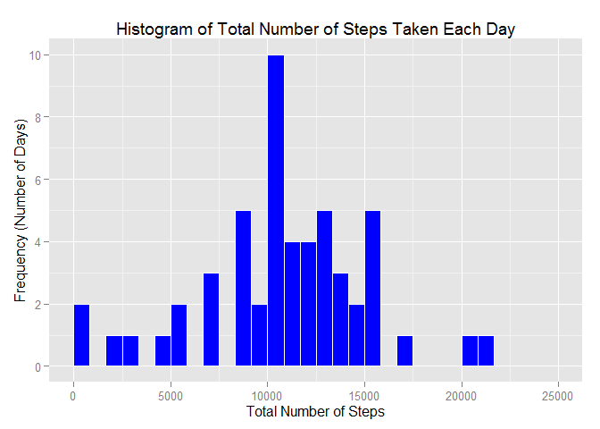
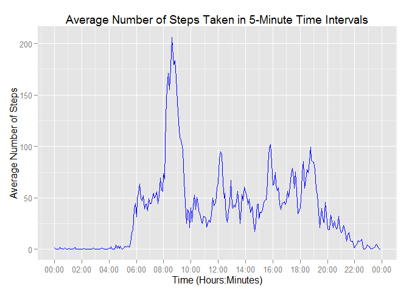
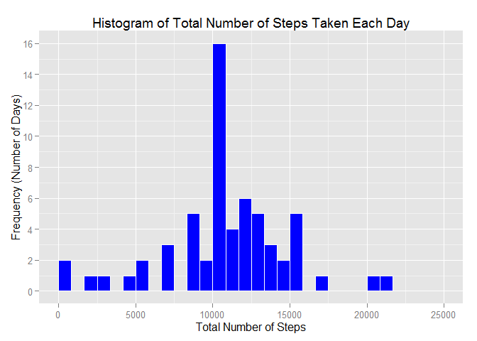
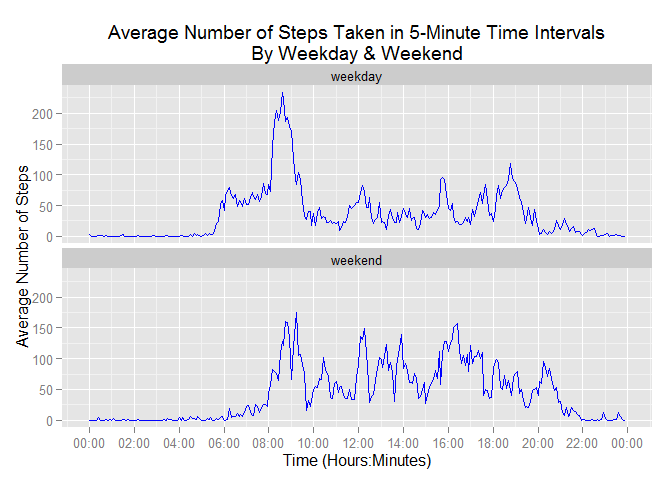

# Reproducible Research: Peer Assessment 1
By CEV  
6 October 2015  
## Introduction
This project answered a series of questions regarding personal fitness data comprising the number of steps taken during 5-minute intervals over a 61-day period. The number of steps included NA values that were imputed for some of the analysis. The headings and numbered questions and instructions listed in this report were from the assignment.

## Loading and preprocessing the data
#### 1\. Load the data

The data was imported as a data frame and converted to a data table, with data.table functions used to summarize the data for much of the assignment.

```r
library("curl") # used with download.file occasionally
library("data.table")
library("ggplot2")
library("scales")

# Download data (also found in related GitHub directory)
# url1 <- "https://d396qusza40orc.cloudfront.net/repdata%2Fdata%2Factivity.zip"
# download.file(url1, destfile = "./data/repdata data activity.zip", method="libcurl")
# unzip("./data/repdata data activity.zip", exdir = "./data") # result is: "./data/activity.csv" file

# Load data
act1  <- read.table("./data/activity.csv", header=TRUE, stringsAsFactors = FALSE, sep = ",")
act1 <- data.table(act1)
```

#### 2\. Process/transform the data (if necessary) into a format suitable for your analysis

Tasks to prepare the data included converting numeric time intervals to datetime intervals and creating the variable typeDay as either "weekend" or "weekday". The typeDay variable was used to impute NA values and to compare weekday and weekend step activity.

```r
act1$time <- sprintf("%04d", act1$interval) # pad with leading 0's for 4-digit character number
act1$time <- paste0(substr(act1$time, 1, 2), ":", substr(act1$time, 3, 4), ":00") # create time variable
act1 <- within(act1, { datetime=as.POSIXct(strptime(paste(date, time), "%Y-%m-%d %H:%M:%S")) }) # create datetime variable
act1$typeDay <- c("weekend", "weekday")[(weekdays(as.Date(act1$date), abbreviate = TRUE) %in% c("Mon", "Tue", "Wed", "Thu", "Fri"))+1] # Create typeDay = weekend or weekday
```

## What is mean total number of steps taken per day?
#### 1\. Calculate the total number of steps taken per day

The keyStats function made it easier to calculate multiple summary statistics within data.table's .SD summary function, and was used to summarize data throughout this analysis. The "any(!is.na(x))" component of the sum and mean calculations prevents them from
returning 0 when all values for a particular period are NA. The keyStats function in those cases returns NA instead of 0.

The fmt1 function displayed selected statistics (mean, sum, median) to 1 decimal and with comma format.

The total number of steps taken each day was stored in data table stepsByDay.


```r
# keyStats function used in summaries
keyStats <- function(x) list(sum = sum(x, na.rm = any(!is.na(x))), mean = mean(x, na.rm=any(!is.na(x))))

# fmt1 function is used to show means and sums to 1 decimal place and with comma format
fmt1 <- function(x, statMethod) {
format(round(statMethod(x, na.rm=any(!is.na(x))), 1), nsmall = 1, big.mark = ",", trim = TRUE)
}

# Create summary data table with steps.sum and steps.mean by date
stepsByDay <- act1[, as.list(unlist(lapply(.SD, keyStats))), by = date, .SDcols="steps"]
```

#### 2\. Make a histogram of the total number of steps taken each day

This histogram is based on the original data that included NA step values.

```r
plot1 <- qplot(steps.sum, data=stepsByDay, geom="histogram") +
        geom_histogram(colour = "white", fill = "blue") +
        ggtitle("Histogram of Total Number of Steps Taken Each Day") +
        labs(x="Total Number of Steps", y="Frequency (Number of Days)") +
        scale_y_continuous(breaks = seq(0, 20, 2)) +
        scale_x_continuous(limits=c(0, 25000), breaks=seq(0,25000,5000))
suppressMessages(print(plot1))
```

 

#### 3\. Calculate and report the mean and median of the total number of steps taken per day

Mean steps per day: **10,766.2**

Median steps per day: **10,765.0**

## What is the average daily activity pattern?
#### 1\. Make a time series plot of the 5-minute interval (x-axis) and the average number of steps taken, averaged across all days (y-axis)

The data table stepsByTime was created to summarize the original data by 5-minute time intervals. The variable steps.mean is the mean number of steps taken during each 5-minute time interval during the 61-day reporting period.

In order to produce the time series plot, the POSIXct date variable "time" was used for the x-axis in place of the numeric variable "interval." Since step.mean was the average for 5-minute time intervals during the 61-day reporting period, the original dates associated with time intervals were not included in (and were not relevant to) the summary table stepsByTime. The date portion of the variable "time" used the current date as a substitute and was not shown on the time series plot (only the 24-hour time intervals are shown).
 

```r
# Create summary data table with steps.sum and steps.mean by time (i.e., by interval)
# Current date will be substituted for original date since it's ignored in graph (time used)
stepsByTime <- act1[, as.list(unlist(lapply(.SD, keyStats))), by = time, .SDcols="steps"]
stepsByTime$time <- as.POSIXct(strptime(stepsByTime$time, "%H:%M:%S", "GMT"))

# Time series plot of 5-min interval (x-axis) and average number of steps taken averaged across 61 days (y-axis)
lower <- min(stepsByTime$time)
upper <- max(stepsByTime$time)-1
limits = c(lower,upper)
plot2 <- ggplot() +
        geom_line(data = stepsByTime, aes(x = time, y = steps.mean), colour = "blue") +
        scale_x_datetime(limits=limits, breaks=("2 hour"), minor_breaks=("1 hour"), labels=date_format("%H:%M")) +
        ggtitle("Average Number of Steps Taken in 5-Minute Time Intervals") +
        labs(x="Time (Hours:Minutes)", y="Average Number of Steps")
suppressMessages(print(plot2))
```

 

#### 2\. Which 5-minute interval, on average across all the days in the dataset, contains the maximum number of steps?


```r
intervalTime <- strftime(stepsByTime$time[stepsByTime$steps.mean == max(stepsByTime$steps.mean)], "%H:%M:%S", "GMT")
interval <- as.numeric(gsub("\\D", "", substr(intervalTime, 1, 5)))
```

Interval of maximum number of steps: **835**

Maximum average steps for an interval: **206.1698**

Interval time for maximum average steps for an interval: **08:35:00**

## Imputing missing values
#### 1\. Calculate and report the total number of missing values in the dataset (i.e., the total number of rows with NA's)

All of the missing values applied to the steps variable. The date and interval variables had no missing data. The calculations below show the steps used to make this determination.

```r
length(which(is.na(act1))) #Total number of rows with missing values (coded as NA), including all columns
```

```
## [1] 2304
```

```r
length(which(is.na(act1$steps))) # 2,404 NA's
```

```
## [1] 2304
```

```r
length(which(is.na(act1$date))) # 0 NA's
```

```
## [1] 0
```

```r
length(which(is.na(act1$interval))) # 0 NA's
```

```
## [1] 0
```

#### 2\. Devise a strategy for filling in all of the missing values in the dataset. The strategy does not need to be sophisticated. For example, you could use the mean/median for that day, or the mean for that 5-minute interval, etc.

The strategy used to impute missing values was to replace NA values with the average number of steps during the same time period on the same type of day (weekend or weekday).

```r
# 1. Create summary data table with steps.sum and steps.mean by time by type of day (weekend or weekday)
stepsByTimeByTypeDay <- act1[, as.list(unlist(lapply(.SD, keyStats))), by = c("interval", "time", "typeDay"), .SDcols="steps"]

# 2. Use merge to replace steps=NA with mean steps for the same time and type of day (weekend or weekday)
stepsByTimeByTypeDay <- stepsByTimeByTypeDay[, c("time", "typeDay", "steps.mean"), with = FALSE] # omit unwanted columns
act2 <- merge(act1, stepsByTimeByTypeDay, by = c("time", "typeDay"), all.x = TRUE) # column of mean steps matching time
act2$steps[is.na(act2$steps)] <- act2$steps.mean[is.na(act2$steps)] # replace steps=NA with steps.mean
```

#### 3\. Create a new dataset that is equal to the original dataset but with the missing data filled in.

The following dataset matches the original data with the exception that missing data (where steps = NA) was replaced with imputed values.

```r
act2 <- act2[, c("steps", "date", "interval"), with=FALSE][order(date, interval)]
```

#### 4a\. Make a histogram of the total number of steps taken each day

The following histogram includes imputed values for steps equal to NA.

```r
# Create summary data table with steps.sum and steps.mean by date
stepsByDay2 <- act2[, as.list(unlist(lapply(.SD, keyStats))), by = date, .SDcols="steps"]

# Make a histogram of total steps taken each day (now that NA values have been replaced)
plot3 <- qplot(steps.sum, data=stepsByDay2, geom="histogram") +
        geom_histogram(colour = "white", fill = "blue") +
        ggtitle("Histogram of Total Number of Steps Taken Each Day") +
        labs(x="Total Number of Steps", y="Frequency (Number of Days)") +
        scale_y_continuous(breaks = seq(0, 16, 2)) +
        scale_x_continuous(limits=c(0, 25000), breaks=seq(0,25000,5000))
suppressMessages(print(plot3))
```

 

#### 4b\. Calculate and report the mean and median total number of steps taken per day

Mean steps per day (with imputed values): **10,762.1**

Median steps per day (with imputed values): **10,571.0**

#### 4c\. Do these values differ from the estimates from the first part of the assignment?

Yes. The mean and median total steps per day calculated with NA values was **10,766.2** and **10,765.0**, respectively. The mean and median total steps per day calculated with imputed values was **10,762.1** and **10,571.0**, respectively.

#### 4d\. What is the impact of imputing missing data on the estimates of the total daily number of steps?

Missing values for steps were imuted using the mean steps for the same time period and same type of day (weekday or weekend). This resulted in adding more data toward the center of the histogram. Average daily steps with imputed data was similar to average daily steps for the original data that ignored NA values. The median decreased slightly because more imputed days were weekdays, with lower average steps. While these balanced out with a few imputed weekend days, it had the effect of moving the mid-point of the data down a few notches from the original median, resulting in a slightly lower median.

## Are there differences in activity patterns between weekdays and weekends?
#### 1\. Create a new factor variable in the dataset with two levels -- "weekday" and "weekend" indicating whether a given date is a weekday or weekend day

The following code prepared the factor variable for "weekend" and "weekday" and formatted dates for the x-axis.

```r
act2$time <- sprintf("%04d", act1$interval) # pad with leading 0's for 4-digit character number
act2$time <- paste0(substr(act1$time, 1, 2), ":", substr(act1$time, 3, 4), ":00") # create time
act2 <- within(act1, { datetime=as.POSIXct(strptime(paste(date, time), "%Y-%m-%d %H:%M:%S")) }) # create datetime
act2$typeDay <- c("weekend", "weekday")[(weekdays(as.Date(act2$date), abbreviate = TRUE) %in% c("Mon", "Tue", "Wed", "Thu", "Fri"))+1]
#stepsByTimeByTypeDay3 <- act2[, as.list(unlist(lapply(.SD, keyStats))), by = c("interval", "time", "typeDay"), .SDcols="steps"]

# Create summary data table with steps.sum and steps.mean by time (i.e., by interval)
stepsByTime2 <- act2[, as.list(unlist(lapply(.SD, keyStats))), by = c("time", "typeDay"), .SDcols="steps"]
stepsByTime2$time <- as.POSIXct(strptime(stepsByTime2$time, "%H:%M:%S", "GMT"))
```

#### 2\. Make a panel plot containing a time series plot of the 5-minute interval (x-axis) and the average number of steps taken, averaged across all weekday days or weekend days (y-axis)

The panel plot shows that activity started earlier and ended earlier on weekdays compared with weekends. General activity levels appeared to be higher during most of the day on weekends compared with weekdays.

```r
lower <- min(stepsByTime2$time)
upper <- max(stepsByTime2$time)-1
limits = c(lower,upper)
plot4 <- ggplot() +
        geom_line(data = stepsByTime2, aes(x = time, y = steps.mean), colour = "blue") +
        facet_wrap(~typeDay, nrow=2) +
        scale_x_datetime(limits=limits, breaks=("2 hour"), minor_breaks=("1 hour"), labels=date_format("%H:%M")) +
        ggtitle("Average Number of Steps Taken in 5-Minute Time Intervals\nBy Weekday & Weekend") +
        labs(x="Time (Hours:Minutes)", y="Average Number of Steps")
suppressMessages(print(plot4))
```

 

## Submitting the Assignment
1\. Commit completed PA1_template.Rmd &#10003;  
2\. a. Commit PA1_template.md url &#10003;  
2\. b. Commit PA1_template.html &#10003;  
3\. Commit figure directory &#10003;  
4\. Push master branch to GitHub &#10003;  
5\. a. Submit URL to GitHub repository &#10003;  
5\. b. Submit SHA-1 hash &#10003;  

#### Final Step
As a final step, the objects created during this session were removed.

```r
rm(list = ls())
```
